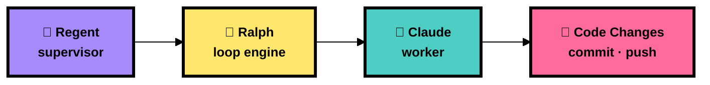
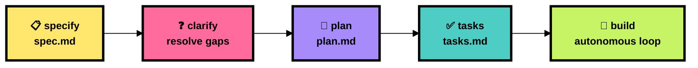
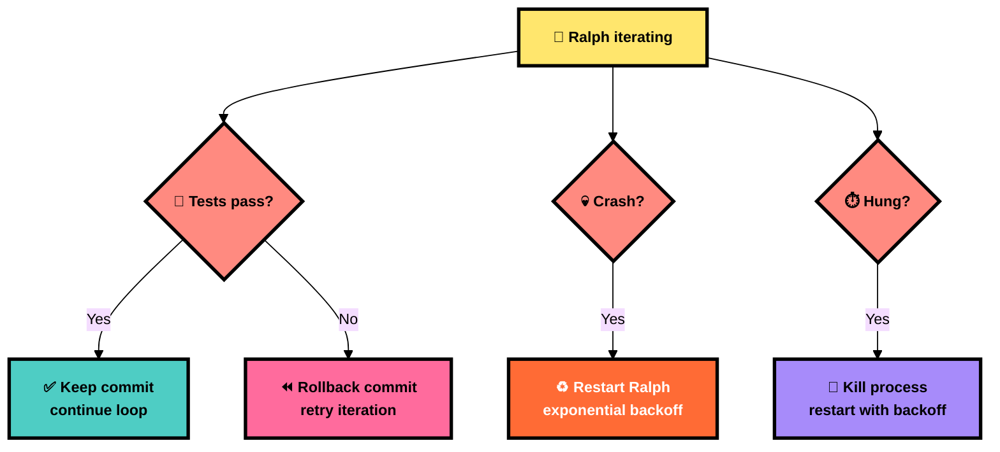

<p align="center">
  
</p>

<h1 align="center">👑 RalphSpec</h1>
<p align="center">
  <strong>Spec-driven AI coding loop CLI — with a supervisor that keeps the King honest</strong>
</p>

<p align="center">
  
  
  
  
  
  
</p>

<p align="center">
  <a href="#-quick-start"><b>Quick Start</b></a> · <a href="#-architecture"><b>Architecture</b></a> · <a href="#-spec-kit-workflow"><b>Spec Kit</b></a> · <a href="#-tui-dashboard"><b>TUI Dashboard</b></a> · <a href="#-the-regent"><b>Regent</b></a> · <a href="#-configuration"><b>Config</b></a> · <a href="#-cli-reference"><b>CLI Reference</b></a>
</p>

---

## 📑 Table of Contents

- [⚡ Quick Start](#-quick-start)
- [🏗️ Architecture](#️-architecture)
- [📜 Spec Kit Workflow](#-spec-kit-workflow)
- [🖥️ TUI Dashboard](#️-tui-dashboard)
- [🏰 The Regent](#-the-regent)
- [🌿 Worktrees (Parallel Agents)](#-worktrees-parallel-agents)
- [⚙️ Configuration](#️-configuration)
- [🎯 CLI Reference](#-cli-reference)
- [📁 Project Structure](#-project-structure)
- [🔒 Safety & Guardrails](#-safety--guardrails)
- [🤝 Supported Agents](#-supported-agents)

---

## ⚡ Quick Start

```sh
# 📥 Install
go install github.com/LISSConsulting/RalphSpec/cmd/ralph@latest

# 🎬 Initialize a new project
ralph init

# 📋 Create a spec from a description
ralph specify "Add user authentication with JWT tokens"

# 📐 Generate implementation plan
ralph plan

# 🔨 Build it — autonomous loop with TUI dashboard
ralph build

# 👑 Or just launch the dashboard and control everything from there
ralph
```

That's it. Ralph reads your spec, drives the selected agent through iterations, commits results, and the Regent supervises the whole thing.

---

## 🏗️ Architecture



| Layer | Role | Details |
|-------|------|---------|
| 🏰 **Regent** | Supervisor | Watches Ralph for crashes, hangs, and test regressions. Rolls back bad commits, restarts with backoff. |
| 👑 **Ralph** | Loop engine | Reads specs, builds prompts, invokes Claude, parses streaming JSON output, commits and pushes results. |
| 🤖 **Claude** | Worker | Claude Code CLI — executes the actual coding work within spec boundaries. |

> [!TIP]
> Ralph targets your **active spec** by default. Use `--roam` to let Claude sweep freely across the entire codebase for polish and improvement work.

---

## 📜 Spec Kit Workflow

Specs live in `specs/NNN-name/` directories. Ralph drives Claude through a sequential, spec-driven development lifecycle:



| Command | Artifact | Description |
|---------|----------|-------------|
| `ralph specify` | `spec.md` | Create a feature spec from a natural language description |
| `ralph clarify` | updates `spec.md` | Resolve ambiguities through targeted clarification questions |
| `ralph plan` | `plan.md` | Generate architecture, tech stack, and implementation phases |
| `ralph tasks` | `tasks.md` | Break the plan into ordered, dependency-aware tasks |
| `ralph run` | — | Execute the spec kit run skill against the active spec |
| `ralph build` | code | Autonomous loop — Claude implements tasks, commits, pushes |

```sh
# 📋 List all specs and their status
ralph spec list

#   📋 003-tui-redesign         ✅ Tasked
#   📐 004-speckit-alignment    ✅ Tasked
#   📋 005-spec-bounded-roam    ✅ Tasked
#   📋 006-polish-and-hardening ✅ Tasked
```

> [!NOTE]
> Ralph auto-detects the active spec from your branch name. Branch `005-spec-bounded-roam` maps to `specs/005-spec-bounded-roam/`. Override with the `--spec` flag.

---

## 🖥️ TUI Dashboard

Launch with `ralph` (no arguments) for the full four-panel interactive dashboard:

```
┌─ Specs ──────────┐┌─ Main ─────────────────────────────────────────┐
│ 📋 003-tui-red…  ││ [Live Log] [Summary]                          │
│ 📐 004-speckit…  ││                                                │
│ ✅ 005-spec-bo…  ││ ▶ Iteration 3 — building spec 005              │
│ ✅ 006-polish-…  ││   Reading spec.md... done                      │
│                   ││   Running Claude... streaming                  │
│                   ││   ██████████░░░░░░ 64%                        │
├─ Iterations ─────┤├─ Secondary ───────────────────────────────────┤
│ #1  $0.12  2m    ││ [Regent] [Git] [Tests] [Cost]                 │
│ #2  $0.08  1m    ││                                                │
│ #3  running…     ││ 🏰 Regent: watching · 0 rollbacks              │
│                   ││ 💰 Session: $0.20 · 3 iterations              │
└───────────────────┘└───────────────────────────────────────────────┘
```

### ⌨️ Keyboard Reference

| Key | Action |
|-----|--------|
| `tab` / `shift+tab` | Cycle panel focus |
| `1` `2` `3` `4` | Jump to Specs / Iterations / Main / Secondary |
| `5` | Jump to Worktrees panel (when worktree support enabled) |
| `b` | Start build loop |
| `R` | Start roam loop |
| `x` | Cancel running loop immediately |
| `s` | Graceful stop after current iteration |
| `?` | Toggle help overlay |
| `q` / `ctrl+c` | Quit |

**Panel shortcuts:**

| Panel | Keys |
|-------|------|
| 📋 Specs | `j`/`k` navigate · `enter` view · `e` edit in `$EDITOR` · `n` create new · `W` launch in worktree |
| 📊 Iterations | `j`/`k` navigate · `enter` view log · `]` switch to summary |
| 📝 Main | `[`/`]` switch tabs · `f` toggle follow · `ctrl+u`/`ctrl+d` page |
| 📡 Secondary | `[`/`]` switch tabs (Regent / Git / Tests / Cost) · `j`/`k` scroll |
| 🌿 Worktrees | `j`/`k` navigate · `enter` view log · `x` stop · `M` merge · `D` discard |

> [!TIP]
> Minimum terminal size: **80×24**. Set your accent color via `[tui] accent_color` in `ralph.toml`.

---

## 🏰 The Regent

The Regent is Ralph's supervisor — it watches the loop and intervenes when things go wrong:



| Feature | Description |
|---------|-------------|
| 🧪 **Test-gated commits** | Runs your test command after each iteration; rolls back on failure |
| 💀 **Crash recovery** | Detects process exit, restarts Ralph with exponential backoff |
| ⏱️ **Hang detection** | Kills Ralph if no output for `hang_timeout_seconds` (default: 5 min) |
| 🔄 **Retry with backoff** | Up to `max_retries` restarts with configurable backoff |
| 📡 **Observable** | All Regent actions stream to the TUI Secondary panel |

---

## 🌿 Worktrees (Parallel Agents)

Requires [worktrunk](https://github.com/nicholasgasior/worktrunk) (`wt`) installed on your PATH.

### Quick Start

```sh
# Run a build in an isolated git worktree (your working dir stays clean)
ralph build --worktree

# Run an isolated Codex-backed build
ralph build --worktree --agent codex

# Same in headless mode
ralph build -w --no-tui --max 10

# List active worktrees
ralph worktree list

# Merge a completed worktree branch and clean up
ralph worktree merge feat/my-branch

# Discard a worktree without merging
ralph worktree clean feat/my-branch
```

### Parallel Agents from the Dashboard

Open the TUI (`ralph`), navigate to the **Specs** panel, and press `W` on any spec to launch it in its own worktree. The **Worktrees** panel (panel 5) shows each active session, including which agent produced it, in real time. Dashboard-launched worktrees use the configured project agent from `[agent].type`.

| Key | Action |
|-----|--------|
| `W` | Launch selected spec in a new worktree (Specs panel) |
| `x` | Stop the selected worktree agent (Worktrees panel) |
| `M` | Merge the selected worktree (Worktrees panel) |
| `D` | Clean (discard) the selected worktree (Worktrees panel) |
| `enter` | View the selected agent's live log in the Main panel |

### Worktree Config

```toml
[worktree]
enabled       = false         # enable worktree support
max_parallel  = 5             # max concurrent agents
auto_merge    = false         # auto-merge on completion (requires tests to pass)
merge_target  = ""            # branch to merge into (default: current branch)
path_template = ""            # worktree path template (uses worktrunk default)
```

With `auto_merge = true` and a `test_command` configured in `[regent]`, completed agents are automatically merged and cleaned up when tests pass. On test failure the worktree is left intact for review.

### Worktree CLI Commands

| Command | Description |
|---------|-------------|
| `ralph worktree list` | List active worktrees and their status |
| `ralph worktree list --json` | JSON output for scripting |
| `ralph worktree merge [branch]` | Merge a completed worktree branch |
| `ralph worktree clean [branch]` | Remove a worktree without merging |
| `ralph worktree clean --all` | Remove all non-running worktrees |

---

## ⚙️ Configuration

Place `ralph.toml` in your project root. All fields are optional with sensible defaults:

```toml
[project]
name = "MyProject"

[agent]
type = "claude"               # claude or codex

[harness]
claude = "claude"             # executable overrides also support provider shims
codex = "codex"

[claude]
model = "sonnet"
max_turns = 0                 # 0 = unlimited agentic turns per iteration
danger_skip_permissions = true
quota_snapshot_file = ""      # status-line JSON snapshot written by operator tooling
quota_snapshot_max_age_seconds = 300
provider = "anthropic"         # label for the inherited primary environment
provider_config_file = ""      # defaults to ~/.claude/providers.json
fallback_providers = ["kimi-1m", "minimax"] # explicit order; [] disables fallback

[codex]
model = ""


[quota]
enabled = false
reserve_percent = 10
exhausted_policy = "fail_closed" # fail_closed or wait
unknown_policy = "allow"          # allow or fail_closed
max_wait_seconds = 3600
max_parallel = 1                  # shared cap across parallel worktree agents

[build]
prompt_file = "BUILD.md"      # prompt template for build iterations
max_iterations = 0            # 0 = unlimited
ludicrous = false             # require structured completion and passing configured tests

[roam]
enabled = false               # --roam flag overrides this
prompt_file = "ROAM.md"       # prompt template for roaming iterations
max_iterations = 0            # 0 = unlimited
focus = ""                    # optional roam topic constraint

[git]
auto_pull_rebase = true       # pull --rebase before each iteration
auto_push = true              # push after each commit

[regent]
enabled = true
rollback_on_test_failure = false
test_command = "go test ./..."
auto_discover_tests = false   # discover a deterministic plan when test_command is empty
max_retries = 3
retry_backoff_seconds = 30
hang_timeout_seconds = 300    # kill if no output for 5 min

[tui]
accent_color = "#7D56F4"      # hex color for header/accent elements
log_retention = 20            # session logs to keep; 0 = unlimited

[notifications]
url = ""                      # ntfy.sh topic URL or HTTP webhook
on_complete = true            # notify on iteration complete
on_error = true               # notify on loop error
on_stop = true                # notify when loop finishes

[worktree]
enabled       = false         # enable worktree support (requires worktrunk)
max_parallel  = 5             # max concurrent worktree agents
auto_merge    = false         # auto-merge and clean up on successful completion
merge_target  = ""            # target branch for auto-merge (default: current branch)
path_template = ""            # worktree directory template (uses worktrunk default)
```

Agent selection precedence is explicit: `--agent` applies to one run, followed by `[agent].type`, then Claude. Supported values are `claude` and `codex`; unknown values fail instead of silently falling back.

Quota admission is opt-in. Codex reads current account rate limits from its documented app-server RPC. Claude reads the latest status-line JSON snapshot from `quota_snapshot_file`; it does not make a hidden API request. A blocked preflight admission or a normalized runtime Claude quota failure switches to the next explicitly configured `fallback_providers` profile. Runtime fallback retries the same prompt in the same iteration. The selected fallback remains active for the run and is shared by parallel worktree workers. After every route is exhausted, Regent pauses without consuming generic retries; authentication, permission, cancellation, and ordinary agent failures never trigger provider switching.

Claude fallback profiles use the same `~/.claude/providers.json` shape and environment-variable allowlist as the `AIProvider` PowerShell module. List the available profile names without printing credentials, then configure their order:

```powershell
Import-Module AIProvider
Get-AIProvider
Clear-AIProvider # ensure Ralph's primary route inherits the normal environment
```

```toml
[claude]
provider = "anthropic"
provider_config_file = "" # defaults to ~/.claude/providers.json
fallback_providers = ["kimi-1m", "minimax"]
```

Ralph reads the profile file directly; it does not mutate the parent PowerShell environment or require `Use-AIProvider` before launch. Each fallback receives an isolated child-process environment, and provider values are never written to logs or state. Provider profiles control their own model, so Ralph omits the primary `claude.model` override after switching. Live output, the TUI header, session summaries, and `.ralph/regent-state.json` identify the active provider.

When `auto_discover_tests = true`, Ralph snapshots one high-confidence plan before agent work. Explicit `test_command` always wins. Recognized metadata includes root `justfile` aggregate gates, package-manager `scripts.test`, Python projects that declare pytest, Go modules/workspaces, and Cargo packages/workspaces. Use `ralph tests detect` to preview and `ralph tests run` to execute the same plan.

### 🔑 Environment Variables

| Variable | Required | Description |
|----------|:--------:|-------------|
| `ANTHROPIC_API_KEY` | ⬜ | Direct API key — Ralph warns if set (prefer Claude Pro/Max subscription) |
| `EDITOR` | ⬜ | Editor for `e` keybind in Specs panel (defaults to system editor) |

> [!WARNING]
> If `ANTHROPIC_API_KEY` is set, Ralph prints a prominent warning on startup. Claude may use direct API billing instead of your subscription. Unset it to avoid unexpected charges.

---

## 🎯 CLI Reference

### Top-level Commands

| Command | Description |
|---------|-------------|
| `ralph` | 👑 Launch the interactive TUI dashboard |
| `ralph init` | 🎬 Scaffold a new ralph project (config, prompts, specs dir) |
| `ralph init --force` | ⚠️ Overwrite Ralph scaffold files and remove legacy `PLAN.md` |
| `ralph status` | 📊 Show last run, cost, iteration count, branch |
| `ralph spec list` | 📋 List all specs and their status |
| `ralph config schema --json` | 🤖 Emit the complete `ralph.toml` contract as JSON Schema |
| `ralph help --json` | 🤖 Emit the complete command tree as versioned JSON |
| `ralph help ludicrous` | 📖 Explain ludicrous-mode evidence, limits, configuration, and examples |

### Spec Kit Commands

| Command | Description |
|---------|-------------|
| `ralph specify "<description>"` | 📋 Create a new spec from a description |
| `ralph plan` | 📐 Generate implementation plan for active spec |
| `ralph clarify` | ❓ Resolve ambiguities in active spec |
| `ralph tasks` | ✅ Break plan into actionable task list |
| `ralph run` | 🚀 Execute spec kit run against active spec |

### Loop Commands

| Command | Description |
|---------|-------------|
| `ralph build` | 🔨 Build mode — autonomous coding loop (alias for `ralph loop build`) |
| `ralph build --roam` | 🌍 Roam freely across codebase, no spec boundary |
| `ralph loop build` | 🔨 Build mode loop |
| `ralph loop run` | 🔁 Run the build loop; use `--roam` for codebase-wide roaming |

### Test Plan Commands

| Command | Description |
|---------|-------------|
| `ralph tests detect [--json]` | Preview the run-start test plan without executing commands |
| `ralph tests run [--json]` | Execute every high-confidence step; fail on inconclusive discovery |

### Human and Agent Help

| Command | Output |
|---------|--------|
| `ralph help <command>` | Self-contained human-readable command semantics and examples |
| `ralph help ludicrous` | Complete ludicrous-mode contract |
| `ralph help --json` | Versioned machine-readable root command tree, flags, defaults, and examples |
| `ralph help build --json` | Machine-readable help for one command |
| `ralph config schema` | Pretty-printed JSON Schema for `ralph.toml` |
| `ralph config schema --json` | Compact JSON Schema for LLM/tool consumption |

JSON help is plain UTF-8 JSON on stdout with no ANSI formatting. Configuration schema properties include TOML keys, types, defaults, supported enums, bounds, critical behavior descriptions, and `additionalProperties: false`.

### Flags (all loop commands)

| Flag | Description |
|------|-------------|
| `--no-tui` | Disable TUI; print plain log lines to stdout (CI/headless) |
| `--no-color` | Disable ANSI color output (pipe-safe) |
| `--max N` | Override max iterations (0 = use config) |
| `--roam` | Roam freely across the codebase (no spec boundary) |
| `--focus "<topic>"` | Constrain roam to a specific topic (e.g. `"UI/UX"`, `"tests"`) |
| `--worktree` / `-w` | Run loop in an isolated git worktree via worktrunk |
| `--agent claude\|codex` | Override the configured agent for this invocation only |
| `--ludicrous` | Build until independent structured completion signals and required test evidence pass |

Ludicrous mode is spec-bound and cannot be combined with `--roam`. Without an explicit positive `--max`, it ignores `build.max_iterations`. Completion requires two consecutive structured successes, no commit during the confirming iteration, a clean worktree, complete declared tasks, and a passing selected test plan. Run `ralph help ludicrous` for the complete contract.

### Examples

```sh
# 🔨 Standard build with TUI
ralph build

# 🌍 Improvement sweep — roam across the whole codebase
ralph build --roam

# 🤖 Headless build for CI (no TUI, no color, max 10 iterations)
ralph build --no-tui --no-color --max 10

# 🔁 Run the loop from the loop namespace
ralph loop run

# 🌍 Run roam mode from the loop namespace
ralph loop run --roam

# 🌍 Roam with a specific focus
ralph build --roam --focus "tests"

# 🌿 Isolated build in a git worktree (requires worktrunk)
ralph build --worktree

# 🌿 Headless worktree build
ralph build -w --no-tui --max 5

# 🔮 Run Codex for one invocation without changing ralph.toml
ralph loop run --agent codex --no-tui

# 🔮 Run Codex from an isolated worktree
ralph build --worktree --agent codex

# Goal-persistent build with evidence-gated completion
ralph build --ludicrous --no-tui
```

---

## 📁 Project Structure

```
📦 RalphSpec
├── 📂 cmd/ralph/                   # CLI entry point (cobra)
│   ├── 🎯 main.go                  #   └─ Root command, signal handling
│   ├── 🔧 commands.go              #   └─ Subcommand definitions
│   ├── ⚡ execute.go               #   └─ Loop execution & TUI wiring
│   ├── 🔌 wiring.go                #   └─ LoopController, store, TUI plumbing
│   └── 🛠️ speckit_cmds.go          #   └─ specify/plan/clarify/tasks/run
├── 📂 internal/
│   ├── 📂 claude/                   # Claude CLI adapter & stream-JSON parser
│   ├── 📂 config/                   # TOML config parsing (ralph.toml)
│   ├── 📂 git/                      # Pull, push, branch, stash helpers
│   ├── 📂 loop/                     # Core iteration: prompt → claude → parse → git
│   ├── 📂 notify/                   # Desktop notifications on loop events
│   ├── 📂 orchestrator/             # Parallel-agent orchestration; one Regent per agent
│   ├── 📂 regent/                   # Supervisor: crash/hang detection, rollback
│   ├── 📂 spec/                     # Spec file discovery & active spec resolution
│   ├── 📂 store/                    # JSONL session log storage & querying
│   ├── 📂 tui/                      # Bubbletea + lipgloss multi-panel TUI
│   │   ├── 📂 components/           #   └─ Reusable TUI components
│   │   └── 📂 panels/              #   └─ Specs, Iterations, Main, Secondary
│   └── 📂 worktree/                 # Git worktree detection, listing, and lifecycle
├── 📂 specs/                        # Feature specifications (spec kit layout)
│   ├── 📂 003-tui-redesign/
│   ├── 📂 004-speckit-alignment/
│   ├── 📂 005-spec-bounded-roam/
│   ├── 📂 006-polish-and-hardening/
│   ├── 📂 007-worktree-support/
│   └── 📂 008-tui-overhaul/
├── 📄 ralph.toml                    # Project configuration
├── 📄 CLAUDE.md                     # AI coding instructions
├── 📄 ROAM.md                       # Roam mode prompt template
├── 📄 BUILD.md                      # Build mode prompt template
└── 📄 CHRONICLE.md                  # Development history & sweep log
```

---

## 🔒 Safety & Guardrails

| Measure | Details |
|---------|---------|
| 📋 **Spec boundaries** | Claude is constrained to the active spec directory by default |
| 🧪 **Test-gated commits** | Regent runs tests after every iteration; bad commits get rolled back |
| ⏪ **Automatic rollback** | Failed test suite → `git revert` → retry with error context |
| ⏱️ **Hang protection** | No output for 5 min → process killed and restarted |
| 💀 **Crash recovery** | Process exit → restart with exponential backoff (up to 3 retries) |
| 🚫 **No global state** | Dependencies passed explicitly; structs hold state, functions transform it |
| 📡 **Full observability** | Every event streams to TUI, JSONL session logs, and optional webhooks |

---

## 🤝 Supported Agents

| Agent | Status | Description |
|-------|:------:|-------------|
| Claude Code CLI | Supported | Default stream-JSON adapter; optional cached status-line quota snapshots |
| OpenAI Codex | Supported | CLI/app-server adapter with direct account rate-limit preflight |

### Codex Troubleshooting

| Symptom | Fix |
|---------|-----|
| `codex agent unavailable: codex executable not found on PATH` | Install Codex CLI and ensure `codex --help` works in the same shell. |
| Codex starts but reports authentication/setup failure | Run `codex login`, then retry the Ralph command. |
| Codex commands fail due to sandbox restrictions | Ralph launches Codex with `--dangerously-bypass-approvals-and-sandbox`; confirm you are running a current Codex CLI and no wrapper script is overriding the arguments. |
| A run used the wrong agent | Check for a per-run `--agent` flag first, then `[agent].type` in `ralph.toml`. |
| Historical output is confusing after changing defaults | Use `ralph status`, TUI run history, or JSONL logs; newly written records include the producing agent. |

---

<p align="center">
  
  
  
  <br/>
  <sub><strong>LISS Consulting, Corp.</strong> · <em>Ralph is King. The Regent keeps him honest.</em></sub>
</p>
